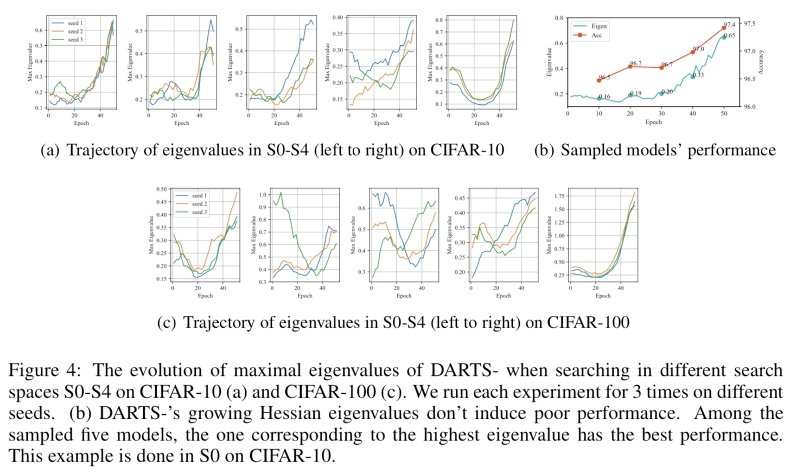
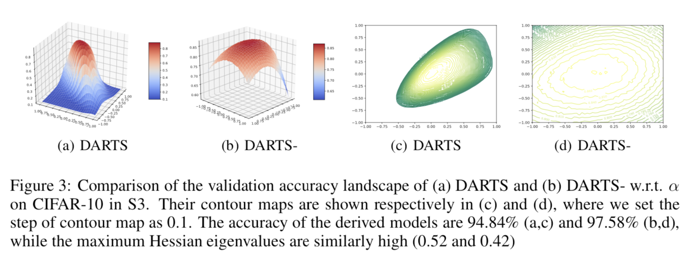

# [ICLR'21] DARTS-: Robustly Stepping out of Performance Collapse Without Indicators [[openreview]](https://openreview.net/forum?id=KLH36ELmwIB)

Authors: Xiangxiang Chu, Xiaoxing Wang, Bo Zhang, Shun Lu, Xiaolin Wei, Junchi Yan

## Architecture Search

See `scripts/run_darts_minus.sh` for searching in S0-S4 (S0 corresponds to S5 in the code) on CIFAR-10 and CIFAR-100.

## Evaluation

See `scripts/run_darts_minus_fulltrain.sh` for the evaluation of CIFAR-100 models in all search spaces and CIFAR-10 models in S4. The rest CIFAR-10 models are evaluated with SGAS code in `script/eval`. 

## Hessian Eigenvalue Calculation

During the architecture search, we turn `--compute_hessian` off by default. Once the search is done, Hessian eigenvalues can be calculated independently from saved checkpoints.

See `scripts/start_calc_hessian.sh`.

## Loss Landscape

See `scripts/start_draw_loss_landscape.sh` for details.

## Recruiting / 招聘

- We are hiring for interns and professionals who are avid in machine learning (especially vision, perception in self-driving, recomendation systems etc.), mailto: zhangbo97(at)meituan.com
- 实习/社招请发简历到zhangbo97(at)meituan.com, [实习JD](https://bbs.cvmart.net/topics/3998).

## Acknowledgement

Code heavily borrowed from [DARTS](https://github.com/quark0/darts), [RobustDARTS](https://github.com/automl/RobustDARTS), [Loss Landscape](https://github.com/tomgoldstein/loss-landscape), and [SGAS]( https://github.com/lightaime/sgas). 
